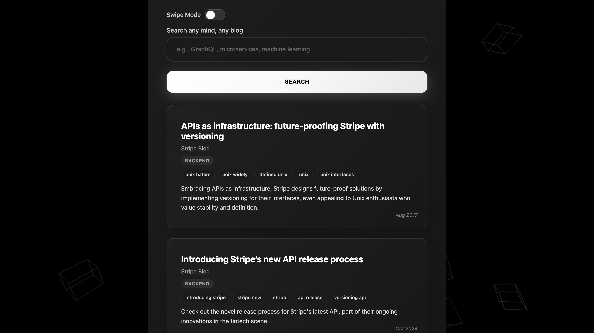
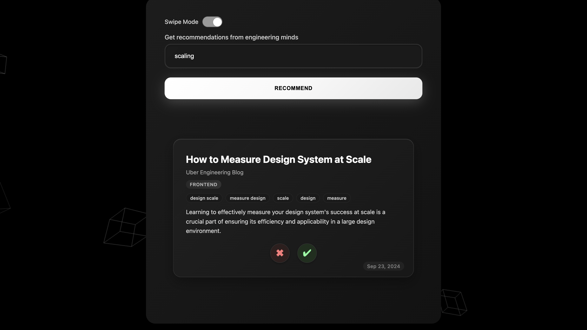

# Engineering Blog Recommender

This is a full-stack AI system that gathers, classifies, tags, embeds, and recommends over 10,000 articles from leading engineering blogs including Netflix, Airbnb, Uber, Stripe, and more.

### Features:

* Semantic search and exploration of engineering articles
* AI-powered article recommendations
* Content preview, swipe-to-like interface
* User authentication and per-user like tracking
* Recommendations personalized using user likes

---

## Screenshots

### Homepage


### Results



### Swipe Mode



---

## Frontend (React + TypeScript)

The frontend is a modern React app built with:

* TypeScript + Vite
* Framer Motion for animations
* CSS Modules for scoped styling
* `react-loading-skeleton` for async placeholders
* Swipe Mode: Tinder-style swipe-to-like experience
* Toggle UI: Switch between search and personalized recommendation views
* Auth-aware UI: Likes are tied to authenticated users

---

## Backend Features

| Feature                      | Description                                                               |
| ---------------------------- | ------------------------------------------------------------------------- |
| Blog Scraper                 | Collects articles using Selenium and BeautifulSoup                        |
| Semantic Classification      | Uses BGE embeddings + cosine similarity to classify articles              |
| Automatic Tagging            | Uses KeyBERT to extract relevant tags                                     |
| Supabase Integration         | Stores article metadata, embeddings, and user likes in hosted Postgres DB |
| Search                       | Search articles by keyword, tag, or source                                |
| Personalized Recommendations | Suggests similar articles using user likes and embeddings                 |
| Analytics API                | Provides trending tags, top sources, and article category statistics      |
| User Auth Integration        | Full authentication flow with Supabase Auth                               |
| Likes Persistence            | Stores user-specific like/dislike data for future personalization         |
| FastAPI Backend              | Modular, production-ready Python API framework                            |

---

## Project Structure

```
.
├── backend/                   # FastAPI backend
│   ├── engine/                # Recommender system logic
│   ├── routes/                # API route handlers
│   ├── tests/                 # Unit, integration, and deployment tests
│   └── main.py
│
├── frontend/                  # React frontend (Vite + TypeScript)
│   ├── components/
│   ├── styles/
│   └── App.tsx
│
├── db/
│   └── supabase_client.py
│
├── scrapers/
│   ├── netflix.py
│   └── ...
│
├── docker-compose.yml
├── .env
└── README.md
```

---

## Setup (Docker)

### 1. Clone the Repository

```bash
git clone https://github.com/yourusername/engineering-blog-recommender.git
cd engineering-blog-recommender
```

### 2. Create `.env` File

```env
SUPABASE_URL=https://your-project.supabase.co
SUPABASE_KEY=your-supabase-key
HF_API_TOKEN=your-huggingface-token
```

Place this `.env` file in the root directory.

### 3. Run with Docker Compose

```bash
docker-compose up --build
```

This will:

* Start the FastAPI backend at `http://localhost:8000`
* Serve the React frontend at `http://localhost:3000` (proxying API calls)
* Connect to Supabase and HuggingFace via your `.env` credentials

---

## API Endpoints

| Endpoint                    | Description                      |
| --------------------------- | -------------------------------- |
| `/api/scrape/netflix`       | Scrapes Netflix Engineering blog |
| `/api/recommend`            | Recommends similar articles      |
| `/api/search/articles`      | Searches articles by keyword     |
| `/api/user/likes`           | Stores likes/dislikes for a user |
| `/api/analytics/tags`       | Returns most frequent tags       |
| `/api/analytics/categories` | Returns distribution by category |

---

## Models Used

* `BAAI/bge-base-en-v1.5` — Sentence embeddings for semantic similarity
* `KeyBERT` — Keyword/tag extraction
* `facebook/bart-large-cnn` — Summarization model via inference API

---

## Example Queries

```bash
curl http://localhost:8000/find/recommend?query=GraphQL
curl http://localhost:8000/search/articles?q=Machine+Learning
```

---

## Testing Infrastructure

| Test Type         | Coverage Area                                  |
| ----------------- | ---------------------------------------------- |
| Linting           | Code formatting using Ruff                     |
| Unit Tests        | Utility functions, schema validation           |
| Integration Tests | API endpoints (auth, likes, search, recommend) |
| Deployment Tests  | Smoke tests to verify deployed API health      |
| Test Frameworks   | Pytest + HTTPX                                 |

All tests are located under `backend/tests/`.

---

## Data Sources

* [Netflix Tech Blog](https://netflixtechblog.com/)
* [Airbnb Engineering](https://medium.com/airbnb-engineering)
* [Uber Engineering](https://www.uber.com/blog/engineering/)
* [Stripe Engineering](https://stripe.com/blog)
* [Tinder Engineering](https://medium.com/tinder)

---
### Testing Done

](https://github.com/yourusername/engineering-blog-recommender/actions)
[](https://github.com/yourusername/engineering-blog-recommender/actions)
[](https://hub.docker.com/repository/docker/yourusername/engineering-blog-recommender)
[](LICENSE)
[](https://github.com/yourusername/engineering-blog-recommender)


## Author

Built by Arijit Chowdhury